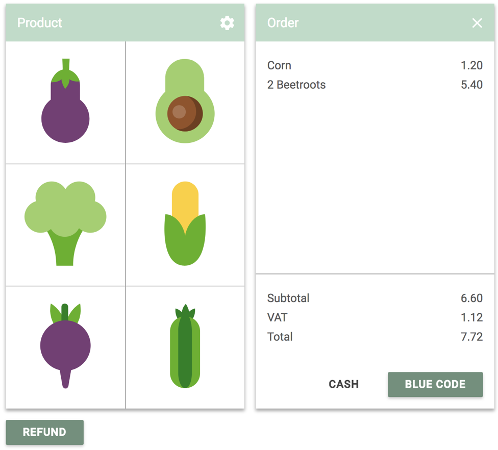

# Blue Code POS Reference Implementation

This project shows how a POS system can be integrated with [Blue Code](http://bluecode.com/).

It shows a small vegetable stand POS and has support for:

  * Payments
  * Cancellation of a running payment request
  * Refunds of earlier transactions.

## Payments

To do a payment, click on a few vegetables and select the payment method "Blue Code". 
Either use the [Sandbox App](https://bluecodepayment.readme.io/v4/docs/getting-started-1#section-sandbox-app) 
to generate a barcode, or choose one of the pre-defined ["magic" barcodes](https://bluecodepayment.readme.io/v4/docs/getting-started-1#section-magic-barcodes).

You will see a log describing the sequence of calls in detail.

Keep in mind that you can also see all the outgoing API calls by opening the developer tools in your browser.
You can also use the developer tools of the browser to simulate being offline or having limited connectivity
(the feature is called [Network Conditions](https://developers.google.com/web/tools/chrome-devtools/network-performance/network-conditions) in Chrome).

## Cancellation

To try out cancellation, either select a magic barcode corresponding to a long-running payment or slow down your
network connection using the developer tools of the browser. Then press "Cancel" while a payment request is running.

## Refunds

Click the "Refund" button at the bottom of the screen to initiate a refund. It will be pre-filled with the transaction
ID of the last payment transaction.

# Running

To run the project locally, check it out and run `yarn start` or `npm start` (obviously, npm or yarn needs to be installed). 

Styling is done using SCSS. Run `yarn run watch-css` to run a file watcher that continuously compiles it to CSS.

For full documentation of the development flow, see [Create React App](https://github.com/facebook/create-react-app), the framework on which this project is built.

# Reusing

All the code relating to the API integration can be found in the class [BlueCodeClient](https://github.com/bluecodecom/pos-example/blob/master/src/client/BlueCodeClient.js). 

The API does not have any dependencies on any other external frameworks, so it should be easily possible to base new implementations on it.

## License

You are free to use the reference implementation code as a starting point for your own implementation efforts. However, Blue Code does not offer support or warranty for this code. Blue Code does also not assume any liability relating to its use.